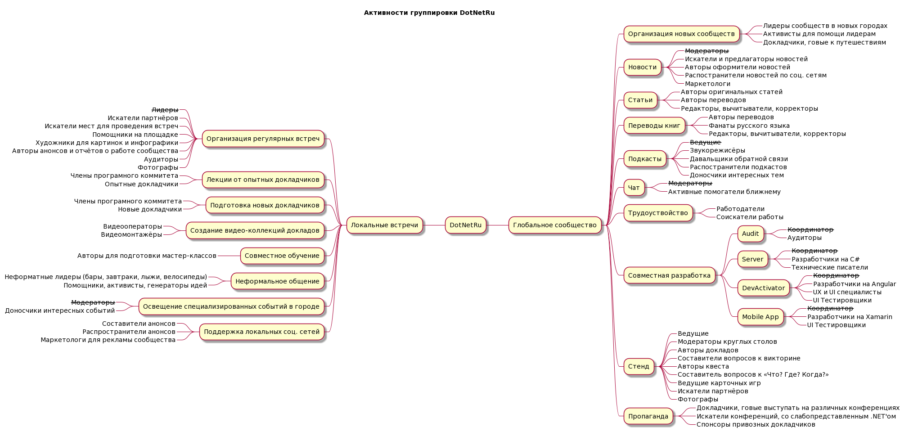

# Активности группировки DotNetRu

Группировка DotNetRu проводит очень много активностей в разных направлениях, жанрах, сферах, с привлечением различных людей и профессий. Здесь собраны основные проекты которыми мы занимаемся.

Кроме самих направлений представлен так же список вакансий для специалистов, необходимых в той или иной деятельности. Обычно в каждом проекте необходима помощь. Данная схема позволит любому желающему найти интересный для него проект, определиться с родом деятельности и начать активную помощь сообществу.

Для правок используйте [исходный документ в формате PlantUML](Activities/Activities.plantuml).

